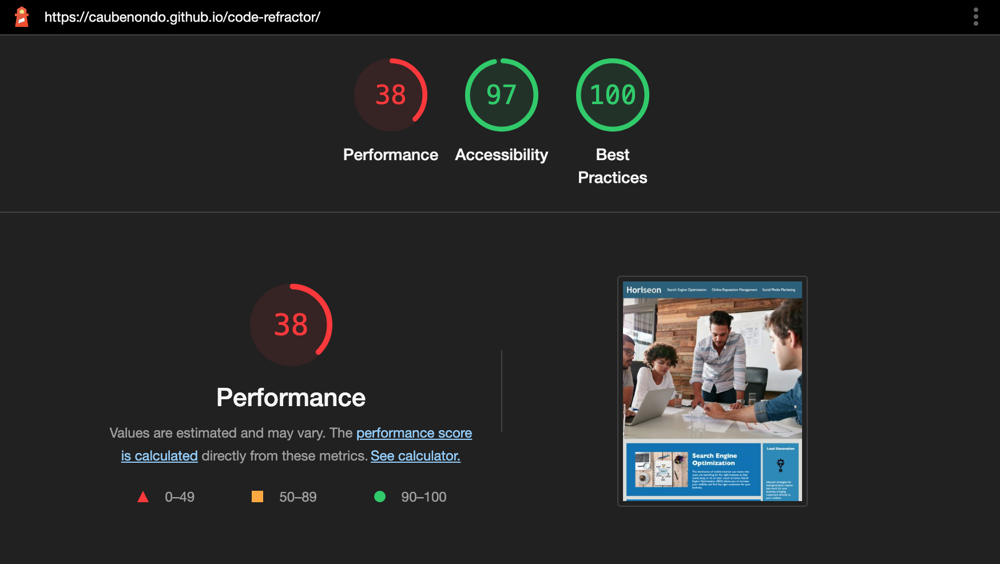
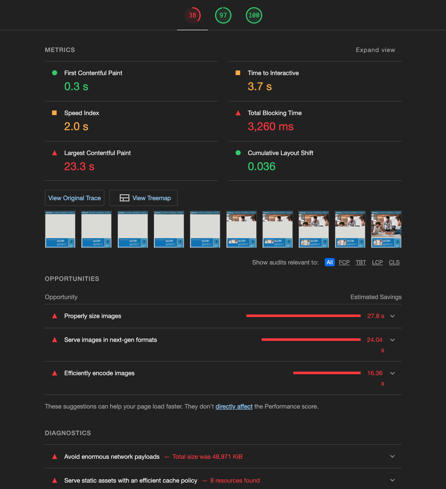

# UCSD Extension bootcamp HW 1

## HTML/CSS code refractory

With provided a basic landing page source code with assets of a digital maketing agency, student had to recontruct the html code to be more semantic and accessible for screen readers and users. Also, student had impoved the CSS codebase for a long term sustainability such as appling the DRY (Don't Repeat Yourself) rule, making the code reusable by removing redundant and overspecific codes on similar elements. 

### Expectation


### Completed Tasks
```
    Making the webpage meets Accessibility Standards (ADA compliances)
    HTML code is in semantic structure
    Use descriptive-named classes in HTML in a logical structure for CSS class selectors
    Working on project with basic Git commands: 
        - Clone and pull project on Github
        - Track changes 
        - Commit change
        - Push project to github
        - Publish project with Github's page feature
```

### Result

#### Final Layout


#### Chrome Lighthouse report on Github page


#### What can be improved in the future?
    - Image optimization would play a great part in site performance improvement
    - There are 4 image files that are larger than 5MB, they drag down the site's loading time

